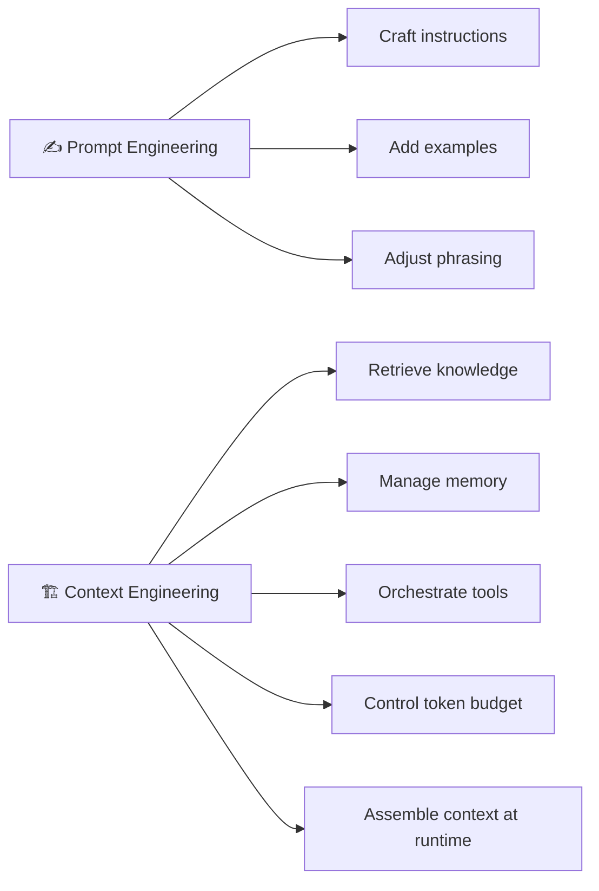

# 2.1 Prompt Engineering vs Context Engineering

Every meaningful shift in how we build software begins with a change in perspective. In the early years of large language models, the dominant belief was simple: if you could write a good enough prompt, the model would give you a good enough answer. That belief gave birth to an entire discipline — **prompt engineering** — and for a while, it worked remarkably well.

But as AI systems grew more ambitious, something became clear. No matter how cleverly you phrased your instructions, certain problems refused to go away. The model didn't know about your internal database. It couldn't remember what you discussed yesterday. It had no idea what happened in the news this morning. And asking it to handle fifty different tasks gracefully with a single paragraph of instructions started to feel like trying to teach someone every subject in school using only one handwritten note.

The limitation wasn't the language. It was the **information**.

---

## Why Prompt Engineering Was Never Enough

Prompt engineering is the practice of crafting instructions that guide a model's behavior. You learn to be specific, use examples, structure your requests clearly, and adjust your tone based on what you need. These are real skills, and they genuinely improve outcomes.

But prompt engineering has one fundamental constraint: it can only optimize what the model already knows. It cannot fill in what's missing.

Think about what a model actually receives. In the simplest case, it's just your message — a few sentences, maybe a paragraph. The model processes that and produces a response based entirely on patterns it internalized during training. For general questions about well-established topics, this works beautifully. The model has seen enough about those subjects that a well-crafted question is all it needs.

The trouble starts when your question requires knowledge that the model doesn't have. It doesn't matter how beautifully you phrase it. If the information simply isn't there, the model will either hallucinate, give a vague answer, or politely admit it doesn't know. No amount of prompt optimization solves this. You can't prompt your way into knowledge the model never had.

---

## The Shift in Perspective

Context engineering starts from a different question. Instead of asking *"How do I write a better prompt?"*, it asks *"What does the model need to know to answer this well?"*

That shift sounds small. In practice, it changes everything about how you build AI systems.

When you reframe the problem this way, you stop thinking about prompts as magic spells and start thinking about them as information delivery vehicles. The prompt becomes a package — assembled at runtime, filled with exactly the knowledge, history, and instructions the model needs for this specific request, at this specific moment.

**Context engineering is the discipline of designing and managing that package.** It's the set of practices, architectures, and engineering decisions that determine what information enters the model's context window and in what form.

This means context engineering covers far more ground than prompt engineering ever did. It includes deciding which documents to retrieve from a knowledge base, how much conversation history to include, which user preferences to surface, how to handle memory across sessions, when to invoke external tools, and how to compress all of that information into a token budget that doesn't break the bank.

---

## What Actually Differs Between Them

To make this concrete, consider a real example. You're building an AI assistant for a software company. A developer asks:

> What changed in the authentication module in the last sprint?

If you're thinking like a prompt engineer, you focus on how to phrase that question to the model — maybe adding "be specific" or "list changes in bullet format." But the model doesn't have access to your Git history. The phrasing is irrelevant.

If you're thinking like a context engineer, you ask: What does the model need to answer this? It needs the actual commit messages and pull request descriptions from the last sprint. So you build a pipeline that fetches those records, filters for the authentication module, and injects them into the context before the model ever sees the question. Now the model has what it needs, and a straightforward question gets a useful answer.

The prompt may be simple. The context is everything.

This is also why the failure modes are different. A prompt engineering failure often looks like the model being confused, misunderstanding the task, or responding in the wrong format. A context engineering failure looks like the model confidently giving wrong information because the context it received was stale, incomplete, or full of noise. The outputs look similar from the outside — a bad answer — but the causes and the solutions are completely different.

---

## Context Engineering in Practice

In production AI systems, context engineering manifests as a layer of software that sits between the user's request and the language model. This layer is sometimes called the orchestration layer, the context builder, or simply the application backend. Whatever you call it, its job is to answer one question for every incoming request: **what should the model see?**

This isn't a one-time decision made when you write the system prompt. It's a dynamic process that runs for every request. The orchestration layer retrieves relevant documents, loads the appropriate conversation history, injects memory from previous sessions, selects which tools to expose, applies safety filters, and manages the token budget — all before handing the fully assembled context to the model.

Modern AI engineering teams spend far more time on this layer than they do on the text of their system prompts. Not because prompts don't matter, but because the quality of the context assembly is what separates a demo that works from a product that works reliably at scale.

A useful way to think about it: **prompt engineering is a skill, context engineering is a discipline.** One helps you write better instructions. The other helps you build better systems.

---

## The Practical Takeaway

As you build AI applications, you'll find that the returns on prompt optimization eventually plateau. You might spend hours tweaking your instructions and see only marginal improvements. When that happens, the answer almost never lies in a better sentence. It lies in better context — more relevant retrieval, smarter memory, cleaner tool outputs, tighter token management.

The mental model shift is simple but powerful: **think of yourself as the person responsible for what the model knows before it starts thinking, not just for how you ask it to think.**

That's what context engineering is. And it's what the rest of this chapter is about.
