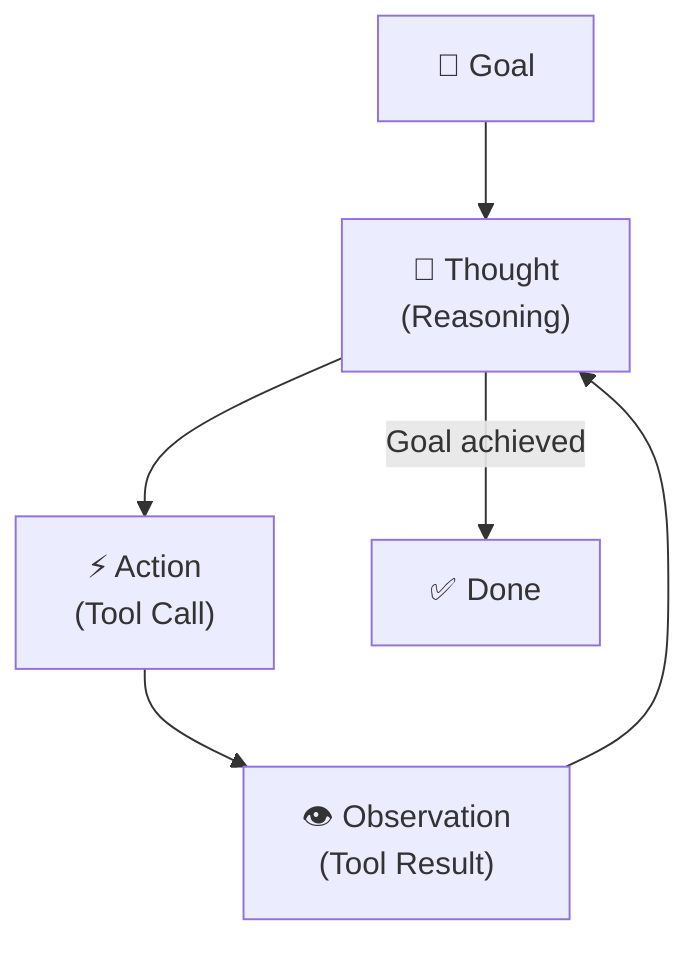
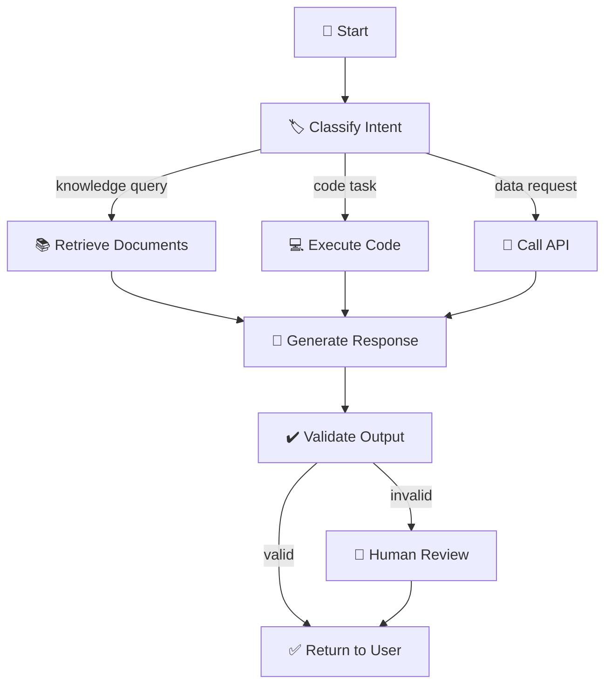

# 2.11 Loop Engineering vs Graph Engineering

When AI applications grew beyond simple question-and-answer interactions, engineers needed a way to describe what happens when a model is given a goal and needs to take multiple steps to achieve it. The first major framework for this was built around a simple idea: the model operates in a **loop**.

Ask a question, get a response. If the response requires using a tool, use it. Observe the result. Ask again with the new information. Repeat until done.

This loop-based architecture — most famously embodied in the ReAct pattern — works for a wide range of tasks and is still widely used. But as agentic AI systems grew more complex, its limitations became increasingly apparent. A new architectural paradigm emerged: **graph engineering**, where the workflow is no longer an open loop but an explicit network of nodes and transitions.

Understanding both, and knowing when to use each, is one of the more important design decisions in production AI engineering.

---

## Loop Engineering: The Autonomous Agent

Loop engineering puts the model in control of its own decision-making process. You give it a goal, a set of tools, and permission to operate autonomously. The model decides what to do next at every step, using its own reasoning.

The canonical implementation is the **ReAct pattern** (Reasoning and Acting). At each iteration, the model produces a structured output with three parts: a **Thought** (its reasoning about what to do), an **Action** (the tool or capability to invoke), and an **Observation** (the result of that action). This thought-action-observation loop continues until the model determines that it has achieved its goal.

The appeal of this architecture is its generality. You don't need to anticipate every possible path the agent might take to solve the problem — you just give it the tools and let it figure out the plan. For exploratory, open-ended tasks, this is genuinely powerful.

The limitation is predictability. Because the model is making the control flow decisions, the path through the task can vary significantly from run to run. The model might choose a suboptimal order of operations, get stuck in an unproductive loop, or make a reasoning error early that cascades into later steps. For production systems where reliability and auditability matter, an agent that can "wander" is a liability.

---

## Graph Engineering: The Orchestrated Workflow

Graph engineering takes control away from the model and gives it to the developer. Instead of one open loop, you define an explicit **workflow graph** — a network of nodes and edges, where each node represents a discrete unit of work, and each edge represents a possible transition between nodes.

In this architecture, the model still does the reasoning within individual nodes — it might write the code, generate the response, perform the classification. But the **control flow** — which node runs next, under what conditions — is defined by the developer in code, not decided by the model at runtime.

This changes the behavior of the system in ways that matter enormously in production:

**Predictability**: You know in advance what set of steps the system might take. This makes the system's behavior easier to reason about, easier to test, and easier to explain to stakeholders.

**Auditability**: Because the path through the graph is recorded, you can inspect exactly what happened for any given request. Which branch did it take? What did the retrieval step return? Where did it fail? This traceability is invaluable for debugging.

**Control**: You can inject guardrails, human review steps, or validation logic at specific points in the graph. This is much harder to do reliably in an open loop.

**Parallelism**: A graph can dispatch multiple nodes simultaneously. If retrieving from three different sources are independent operations, a graph architecture can run them in parallel rather than sequentially. An open loop runs one action at a time.

---

## The Practical Differences

To make the comparison concrete, imagine you're building a system that handles customer service requests. An employee has submitted a ticket asking about their expense report status.

**In a loop-based architecture**, you give the model the user's message and tools to access HR systems, finance systems, and communication platforms. The model decides: should I check HR first or finance first? Should I look up the employee's history? Should I send an email or just respond in the ticket? Each run might take a different path, and you have limited visibility into why.

**In a graph-based architecture**, you define the workflow explicitly: classify the request type, retrieve the relevant expense report from the finance system, check the approval status, generate a response based on the status. Each step is deterministic given the same inputs. You can test each node independently, add a validation step after generation, and include a human-review branch for cases where the expense report is flagged.

Neither is wrong. The loop-based approach is faster to build and handles edge cases the graph doesn't anticipate. The graph-based approach is more reliable, more testable, and more maintainable at scale.

---

## When to Use Each

**Loop engineering** tends to work well when:

- The task is exploratory and the optimal path isn't known in advance
- The range of possible actions is large and the right sequence depends heavily on intermediate results
- You're in an early experimental phase and want the model to surface unexpected approaches
- The cost of occasional mistakes is low and the value of full autonomy is high

**Graph engineering** tends to work well when:

- The workflow has predictable structure, even if individual steps involve model reasoning
- Reliability, auditability, and testability are non-negotiable requirements
- Different parts of the workflow need to run in parallel for performance
- Human review or approval needs to be injected at specific points
- The system needs to explain itself — why it took a particular action, what information it used

**LangGraph**, which is the most widely adopted framework for graph-based AI workflows, is notable because it supports **cyclic graphs** — graphs that can loop back to previous nodes. This is important because many real tasks aren't pure DAGs. A code generation workflow might generate code, test it, and loop back to regenerate if the tests fail. A research workflow might retrieve information, generate hypotheses, evaluate them, and loop back for more retrieval. Cyclic graph support lets you build these refinement loops while maintaining the structure and observability of a graph-based architecture.

---

## The Hybrid Reality

In practice, most sophisticated production systems aren't purely one or the other. They use **graph engineering as the high-level architecture** and **loop engineering as the implementation of specific nodes within the graph**.

The top-level workflow is a graph: classify request, retrieve context, generate response, validate, return. Each node in the graph may internally use a model that operates in a loop — reasoning through multiple steps, calling tools, refining its approach. The loop happens inside a bounded node; the graph controls what happens next after the node completes.

This hybrid approach gives you the predictability and control of graphs at the system level, and the flexibility and reasoning power of loops at the component level. It's the architecture that most mature AI engineering teams end up converging on — not because it's the easiest to build, but because it handles the widest range of requirements without sacrificing reliability.

Understanding where loops are powerful and where graphs are necessary is the conceptual foundation for designing AI workflows that work not just in demos, but in production, under load, with real users, where things go wrong in ways you didn't anticipate. The goal is always to give the model the authority it needs to reason effectively, while keeping the authority you need to ensure the system behaves reliably.
