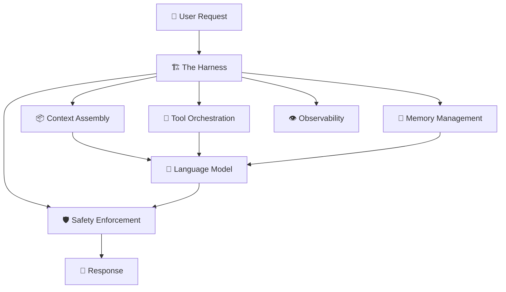

# 2.2 Harness Engineering

A language model, on its own, is a reasoning engine. Give it some text, and it will generate the most probable continuation of that text. That's genuinely impressive — but it isn't a product.

To turn a language model into something useful in the real world, you need to surround it with infrastructure. You need to decide what it knows, what it can do, how it's constrained, how it's monitored, and how it recovers when things go wrong. You need, in short, to build a **harness**.

Harness engineering is the discipline of constructing that surrounding infrastructure. If the model is the engine, the harness is everything else — the chassis, the steering, the sensors, the fuel system, and the safety mechanisms that make it possible to actually drive.

---

## What a Harness Actually Does

Imagine you've been handed the most intelligent assistant in the world. They can reason about anything, write in any style, and solve complex problems on demand. But there's a catch: every time you bring them a new task, they've completely forgotten every previous conversation. They don't know who you are, what your company does, what tools they have access to, what they're allowed to say, or what format their output should be in.

Your job is to build the system that answers all of those questions before they start working.

That's the harness. It handles everything the model can't handle for itself:

**Context assembly** is about deciding what information gets delivered to the model for each request. This includes the user's message, relevant retrieved documents, conversation history, user preferences, and any application-specific data the model needs to be useful.

**Tool orchestration** is about giving the model access to capabilities beyond its training data. A model without tools can generate text. A model with tools can search the web, run code, query a database, send emails, or create calendar events.

**Memory management** is about maintaining continuity across what are, from the model's perspective, completely independent requests. The harness stores what needs to persist and retrieves it at the right moment.

**Safety enforcement** is about applying guardrails that operate at the infrastructure level rather than relying solely on the model's own judgment. Not "please don't do X" in the prompt — actual constraints that intercept and block certain outputs before they reach the user.

**Observability** is about capturing enough information about each request to understand what happened, trace where failures occurred, and systematically improve the system over time.

---

## The Harness Layers

In practice, most production AI systems organize their harness into a small number of distinct layers, each with a clear responsibility.

### The Gateway Layer

Before any request reaches the orchestration logic, it typically passes through a gateway. The gateway handles authentication, rate limiting, abuse detection, and routing. If a user sends an unusually large request, or if a particular user is sending requests too fast, the gateway handles this before the request touches anything expensive like a model call or a database query.

The gateway is also where you can implement model routing — sending simple requests to cheaper, faster models while reserving frontier models for tasks that genuinely require them. This one decision alone can reduce inference costs dramatically at scale.

### The Orchestration Layer

The orchestration layer is the brain of the harness. This is where the application logic lives — not the model's reasoning, but the system's reasoning about *how to use the model*.

When a request arrives, the orchestration layer decides what to do with it. Should it retrieve documents first? Should it load recent conversation history? Should it break the task into subtasks and handle them sequentially? Should it call an external API before or after the model responds? All of these decisions happen here, and they happen through code you write — not through the model's own judgment.

This distinction matters. The orchestration layer gives you **deterministic control** over the flow of your AI application. Rather than hoping the model will make good decisions about when to search and when to respond from memory, you write explicit logic that makes these decisions predictably, every time.

### The Context Assembly Layer

Once the orchestration layer has decided what information the model needs, the context assembly layer actually builds the prompt that gets sent for inference. This includes pulling together the system prompt, relevant retrieved chunks, conversation history, tool definitions, and the user's latest message — and organizing them in a way that makes the most effective use of the available token budget.

Context assembly sounds straightforward but is one of the places where most production AI systems have the most room to improve. Sending too much context increases costs and can confuse the model with noise. Sending too little leaves the model uninformed and prone to hallucination. Good context assembly is the engineering practice of getting this balance right.

### The Response Processing Layer

After the model generates a response, the harness isn't done. The response processing layer validates the output, applies any post-processing logic, formats it appropriately, and decides how to present it to the user. For structured outputs — JSON, code, formatted data — this layer verifies that the output conforms to the expected schema and handles gracefully the inevitable cases where it doesn't.

---

## The Stable Spine Pattern

One pattern that experienced AI engineers often reach for is something informally called the **stable spine**. The idea is to structure your context so that the most durable, highest-priority information — core system instructions, the model's identity, non-negotiable behavioral constraints — sits at the very beginning of every prompt, unchanged across requests.

This matters because models tend to pay more attention to information that appears early in the context. By placing your most important instructions at the top and keeping them consistent, you get more reliable behavior and make debugging significantly easier. When something goes wrong, you know your core instructions haven't shifted, so you can focus your investigation elsewhere.

Dynamic, request-specific information — retrieved documents, conversation history, current task details — gets layered on top of this stable foundation. The result is a prompt with a predictable structure that's easy to reason about and easy to iterate on.

---

## Why Not Just Rely on the Model?

A reasonable question at this point is: why build all this infrastructure at all? Frontier models are increasingly capable. Can't you just give them a goal and trust them to figure out the rest?

You can, and for many experimental use cases, that works fine. But for production systems serving real users, relying entirely on the model's own judgment introduces reliability problems that infrastructure can solve.

When a model decides autonomously whether to use a tool, you have no guarantee it will make that decision consistently. When the model manages its own memory, you have no visibility into what it's retaining and what it's discarding. When the model applies its own safety reasoning, you can't be certain the guardrails will hold under adversarial pressure.

The harness moves these decisions from the probabilistic domain of model behavior into the deterministic domain of software engineering. You write code that reliably does what you need it to do, and the model handles the reasoning tasks that it's actually good at.

In production AI engineering, this is the core philosophy: **trust the model to reason; don't trust it to administrate**. The harness does the administration, and the model does the thinking.

---

## Building Incrementally

One practical lesson from teams that have shipped AI systems in production: don't try to build the entire harness upfront. Start with what you need today.

Early on, that might be just a system prompt and a simple context builder. As you observe where your system fails — where the model lacks information, where outputs are inconsistent, where costs are higher than expected — you add the appropriate harness components to address those specific problems.

Harness engineering isn't a one-time architecture decision. It's an ongoing engineering practice that evolves as your system matures, your usage patterns become clearer, and your users' needs become better understood.

The best AI applications are rarely built around unusually clever prompts. They're built around unusually well-engineered harnesses.
