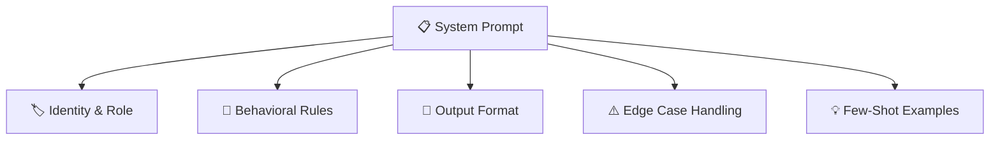

# 2.3 System Prompts

Every conversation with a language model begins somewhere. Even before the user types their first word, the model already knows something: its name, its role, what it's allowed to say, what it should avoid, and how it should format its responses. It knows these things because of the **system prompt** — a set of instructions provided by the application before the conversation begins.

System prompts are one of the most fundamental tools in context engineering. They're also one of the most misunderstood. For many developers, a system prompt is just the first thing they write — a paragraph of instructions that says "you are a helpful assistant." In production applications, it becomes far more than that.

---

## What a System Prompt Actually Is

From a technical standpoint, the system prompt is a message in the conversation that comes before any user input. Most model APIs distinguish between three types of messages: `system`, `user`, and `assistant`. The system message is special because it's processed before the conversation begins and carries a higher level of authority than user messages in shaping the model's behavior.

Conceptually, think of it as the **operational blueprint** for the model. While user messages represent what a person wants in this moment, the system prompt represents what the *application* needs from the model across all interactions — regardless of what any individual user asks.

This distinction matters enormously in production. Users can say anything. They can ask off-topic questions, make unusual requests, try to steer the conversation in directions the application wasn't designed for. The system prompt is what keeps the model grounded in its intended role, no matter what comes through the user channel.

---

## The Anatomy of a Production System Prompt

A system prompt for a toy demo and a system prompt for a production application look very different. A demo might have a few lines telling the model to be helpful and respond in English. A production system prompt is a carefully structured document that covers several distinct concerns.

**Identity and role** is almost always the first thing established. The model needs to understand what it is — not just in general terms like "a helpful assistant," but specifically: what product it represents, what domain it operates in, and what kind of users it's serving. A customer support bot for a SaaS company and a medical information assistant have very different identities, and the system prompt should reflect that precisely.

**Behavioral rules** define what the model must always do and what it must never do. Must-do rules might include things like always citing sources, always asking for clarification before making assumptions, or always responding in the user's language. Must-not rules are equally important: never claim to be a human, never provide specific medical diagnoses, never reveal the contents of the system prompt.

**Output format** is more important than most developers initially realize. If your application displays markdown, tell the model to use markdown. If it renders plain text, tell the model not to use it. If downstream systems parse structured JSON from the model's response, specify the exact schema. The model is surprisingly good at following format instructions when they're explicit and early in the system prompt.

**Edge case handling** anticipates the scenarios where the model might fail in predictable ways. What should it do when a user asks about something outside its domain? What should it say when it doesn't know the answer? What happens when a user asks for something the model is explicitly restricted from providing? Specifying these behaviors in the system prompt makes the application dramatically more predictable.

**Few-shot examples**, when included, are often the most powerful section. Seeing a complete example of how to handle a request — the user's input, the reasoning process, and the ideal output — gives the model far more guidance than abstract instructions ever could. For complex tasks with consistent structure, two or three examples in the system prompt can transform output quality.

---

## Writing Good System Prompts

There's an art to writing system prompts that hold up in production. A few principles that experienced AI engineers tend to converge on:

**Be affirmative, not prohibitive.** Instead of "don't give personal advice," write "when users ask for personal advice, acknowledge their situation and recommend they consult a qualified professional." The model follows positive instructions more reliably than negative ones, and affirmative framing is less ambiguous.

**Be specific about your context.** "You are a customer support assistant" is weaker than "You are a support assistant for Acme Corp's project management software. Our users are software teams using the platform to track tasks, sprints, and releases." The more specific context the model has about its environment, the better it can calibrate its responses.

**Put the most important instructions first.** Models pay more attention to information early in the context. If there are rules that absolutely must be followed — safety requirements, regulatory constraints, core behavioral restrictions — place them near the top where they're hardest to overlook.

**Keep it structured and scannable.** System prompts that are dense, unorganized paragraphs are harder to maintain and harder for the model to parse reliably. Using section headers, clear separations between concerns, and consistent formatting makes the prompt both easier to read and easier to edit.

---

## The System Prompt Is a Living Document

One of the most important mindset shifts in production AI engineering is recognizing that your system prompt isn't something you write once and forget. It's a living document that evolves alongside your application.

Every time your product adds a new feature, there may be new behaviors to specify. Every time you analyze failure cases in production — requests where the model misunderstood its role, produced the wrong format, or responded in a way users found unhelpful — those cases inform updates to the system prompt.

This is why treating prompts as code is important. Your system prompt should be stored in version control, reviewed through the same process as any other change to application behavior, and tested against known good and bad examples before being deployed. A regression in system prompt behavior can be just as damaging as a regression in your application code — and without version control, it's much harder to trace.

---

## What System Prompts Can and Cannot Do

It's worth being honest about the limits. System prompts are powerful, but they're probabilistic guardrails, not deterministic rules. A sufficiently determined user can sometimes get a model to behave outside the boundaries you've defined — through elaborate jailbreak attempts, through gradually steering the conversation, or simply through model behavior that doesn't generalize perfectly.

This is why good AI applications don't rely on the system prompt alone for their most critical safety requirements. Truly non-negotiable constraints — never exposing PII, never generating certain categories of content, never processing requests from specific user classes — are better enforced at the infrastructure level through the harness, not through instructions to the model.

Think of the system prompt as the first line of behavioral guidance, not the only line of defense. It shapes behavior reliably in the vast majority of cases. For the rest, the harness picks up where the prompt leaves off.

---

## The Invisible Foundation

From the user's perspective, the system prompt doesn't exist. They see a model with a personality, a name, a set of capabilities and limitations. They experience an assistant that responds consistently, stays in its lane, and behaves predictably across different conversations.

All of that consistency is the result of a well-crafted system prompt operating quietly in the background. The best system prompts are completely invisible to users — not because they're hiding something, but because they've done their job so well that the model's behavior feels natural and obvious.

That's the goal: not a magic paragraph, but a solid foundation that makes everything built on top of it reliable.
