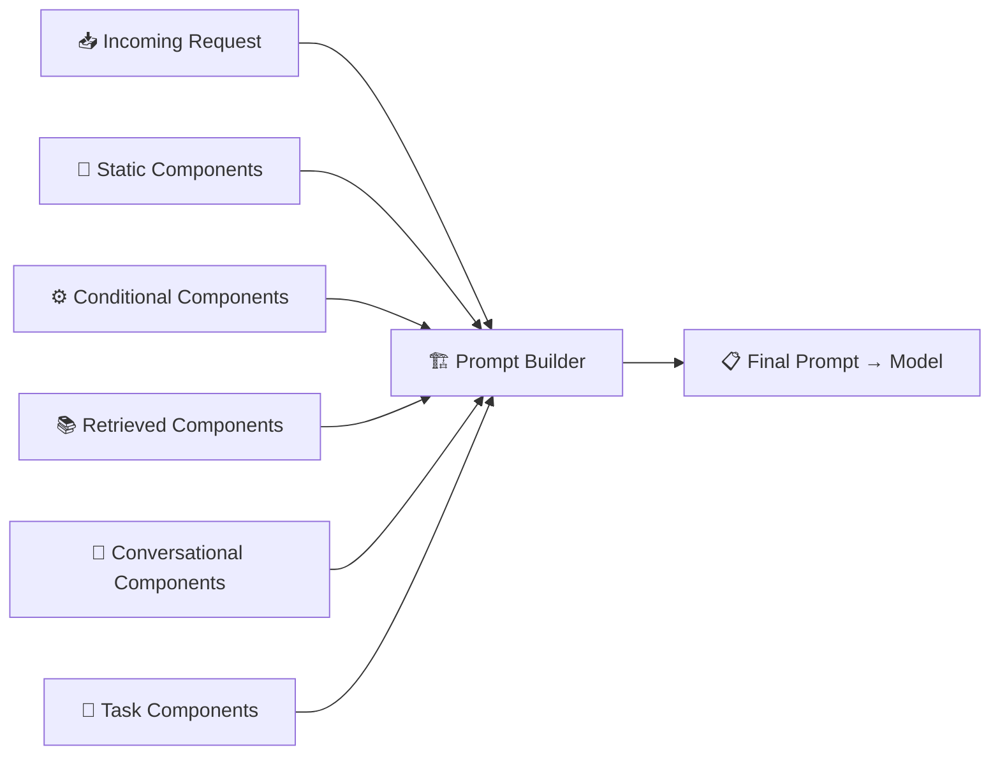

# 2.4 Dynamic Prompt Construction

There's a moment in every AI project when static prompts start to break down. You've written a careful system prompt, tested it against a few cases, and it works well. Then usage grows. Users come from different countries, speak different languages, have different levels of expertise, and ask questions you didn't anticipate. Some are on a free plan, some are enterprise customers. Some are beginners, some are experts who'll be annoyed if you over-explain.

A single static prompt can't serve all of them well. What you actually need is a prompt that **builds itself differently for every request** — one that assembles the right combination of instructions, context, and information based on who's asking, what they're asking, and what's currently known about their situation.

That's dynamic prompt construction.

---

## Static vs Dynamic Prompts

A static prompt is a fixed string. You write it once, it gets sent to the model unchanged for every request. This is fine for simple applications and early prototypes. But static prompts have a fundamental limitation: they treat every user and every request as identical.

Dynamic prompt construction treats the prompt as something that's **built at runtime**, on a per-request basis. Instead of a single text string, you have a collection of components — some stable, some conditional, some user-specific, some retrieved — that get assembled together into the final prompt that gets sent to the model.

This is a significant shift in how you think about prompt design. Instead of asking "what should my prompt say," you ask "what components does the prompt need, and how do they get selected and assembled for this specific request?"

---

## The Components of a Dynamic Prompt

A well-designed dynamic prompt construction system typically works with several categories of components:

**Static components** are the parts that never change — or almost never. Your core system instructions, the model's identity, fundamental behavioral constraints. These go in every prompt because they define the baseline behavior of your application. They're the stable spine.

**Conditional components** are blocks of content that only appear when certain conditions are met. A premium user might see extended capabilities explained. A user who has previously made errors might get additional clarifying context. A user in a regulated industry might receive compliance-specific instructions. These conditionals let your prompt adapt to user state without bloating every prompt with content that's only relevant to a subset of users.

**Retrieved components** are pieces of information that get fetched from external sources — a knowledge base, a database, a vector store — based on what the user is asking about. These are the heart of RAG-based applications. The prompt doesn't know in advance what documents it will contain; it knows *how* to go get the right ones.

**Conversational components** are the recent history of the conversation — the last few turns of dialogue that give the model context about what's already been discussed. This is also dynamic: you might include the last five messages, or summarize a longer history, or selectively include only the turns that are relevant to the current question.

**Task-specific components** capture the immediate details of the current request — user input, any uploaded files, selected text, the output of a previous step in an agent workflow. These change with every single request.



---

## Template Engines and Runtime Assembly

At the implementation level, dynamic prompt construction usually involves some form of template system. The simplest version is just string interpolation — you have a template with placeholders, and you fill them in at runtime:

```
You are a support assistant for {company_name}.
The user's subscription tier is {subscription_tier}.
Respond in {user_language}.
```

For more complex applications, you'll want a proper template engine that supports conditional logic. Jinja2 is a common choice because it lets you write templates with if-statements and loops directly in the text:

```

You have access to advanced features including bulk exports and API access.

You have access to standard features. Upgrade to enterprise for additional capabilities.

```

This is more powerful than simple interpolation because you can include or exclude entire sections based on runtime conditions, without writing separate prompts for each case.

At the highest level of sophistication, prompt construction becomes an orchestration problem — a pipeline that runs a series of steps (retrieve documents, load user preferences, format conversation history, apply safety rules) and combines their outputs into the final prompt. Frameworks like LangChain and LlamaIndex provide abstractions for building these pipelines, though many teams build their own to maintain more control.

---

## Why Order Matters

One of the subtler aspects of dynamic prompt construction is that the **order of components matters**. Language models don't process a prompt like a human reads a document — they're sensitive to the structure and sequence of what they receive.

Critical instructions generally belong near the top. If you have a safety rule that must be respected, you want it seen early, not buried in the middle of a long context. Retrieved documents often work better when they come before the question that requires them — the model has the information loaded when it encounters the task. Conversation history typically belongs just before the current user message, preserving the natural flow of dialogue.

This isn't a hard universal rule — different models behave somewhat differently, and the right structure also depends on what you're trying to accomplish. But it's a variable worth being deliberate about. The same pieces assembled in a different order can produce noticeably different output quality.

---

## Testing Dynamic Prompts

Testing a static prompt is straightforward: you run it against some inputs and check the outputs. Testing a dynamic prompt construction system is more complex because what gets assembled depends on state — user data, retrieved documents, conversation history — that varies across requests.

Good testing for dynamic prompts involves a few practices. First, **snapshot testing**: capture the fully assembled prompts for a set of representative requests, and verify that the assembly logic produces the right output for each scenario. Second, **component testing**: test each component and condition independently so that you can isolate failures. Third, **coverage testing**: ensure that your test suite exercises the different combinations of conditions that your application actually encounters, not just the happy path.

This is one area where treating prompts as code pays off most clearly. When your prompt construction is implemented as software — not a static text file — you can apply all the same testing discipline that you'd apply to any other piece of application logic.

---

## The Goal Is Relevance, Not Completeness

One trap that's easy to fall into with dynamic prompt construction is trying to include everything that *might* be relevant. You add every possible conditional, retrieve a wide range of documents, include the full conversation history, and end up with an enormous prompt that the model has to process.

The goal isn't completeness. It's **relevance**. The best prompt for any given request is the one that contains exactly the information needed to answer well — no more, no less.

This is harder than it sounds in practice, because you have to predict what will be useful before you know what the model will say. But it's the right objective to optimize for. A shorter, more focused context with the right information will almost always outperform a longer, unfocused context that buries the relevant pieces in noise.

Dynamic prompt construction gives you the machinery to pursue that goal. The engineering discipline is in knowing which components to assemble, when, and in what order — for this user, this request, this moment.
