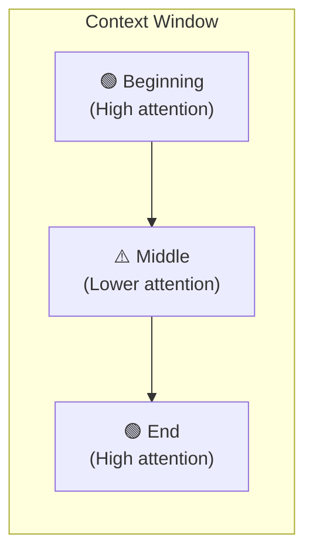

# 2.5 Context Window Management

Every language model has a context window — the total amount of text it can process in a single request, measured in tokens. For the first generation of LLMs, this was quite small: 4,000 or 8,000 tokens, which forced developers to be ruthless about what they included. Today, frontier models offer windows of 128,000 tokens or more, and some support over a million.

You might expect this to make context management a solved problem. If the window is big enough to hold everything, why not just include everything?

The answer reveals something important about how language models actually work — and why managing your context window is still one of the most consequential engineering decisions you make.

---

## The Window Is a Budget, Not a Container

The most useful mental model for a context window is a **budget**, not a container. The difference matters.

A container holds things. You keep adding until it's full, and you worry when it's about to overflow. A budget is something you allocate deliberately, because spending it in one place means it isn't available somewhere else.

When you think of the context window as a budget, the question changes. Instead of "what else can I fit in here?", you ask "is this piece of information worth its token cost?" Every document you include, every turn of conversation history you preserve, every example you add — these are spending decisions.

This framing is useful because it focuses attention on signal-to-noise ratio. Tokens that contribute relevant, high-quality information improve the model's output. Tokens that are redundant, off-topic, or loosely related actively dilute the model's attention. And more tokens mean higher cost, higher latency, and sometimes lower quality. All three of those things matter in production.

---

## The Lost-in-the-Middle Problem

There's a well-documented phenomenon in large language model behavior called the "lost in the middle" effect. When a model processes a very long context, it tends to pay more attention to information near the beginning and near the end — and relatively less attention to information buried in the middle.

This was demonstrated empirically in research: when a relevant document was placed in the middle of a long context, retrieval accuracy dropped significantly compared to when the same document was placed at the start or end. The model wasn't ignoring the middle intentionally; it's a consequence of how attention mechanisms work in practice over long sequences.

The practical implication is significant. Simply having the right information in your prompt doesn't guarantee the model will use it well. **Where** that information appears matters.

For production systems, this translates to a few concrete practices. Your most important information — core instructions, the critical context for the current task — should generally appear early in the prompt or immediately before the user's question. Retrieved documents that are highly relevant should be placed closer to the edges of the context, not lumped randomly in the middle. If you have a rule that must be respected, don't bury it.

---

## Strategies for Managing the Budget

### Selective Retrieval

The most impactful thing you can do for context quality is to be selective about what you retrieve. Instead of fetching every document that might be related to the user's question, retrieve only the ones that are most likely to be useful.

This is where re-ranking comes in. A first-pass retrieval step might use vector similarity to find a hundred potentially relevant chunks. A re-ranker then evaluates those candidates more carefully — considering both relevance to the query and usefulness for the specific task — and selects the top five or ten. What the model ultimately sees is a small set of highly relevant, high-quality context, rather than a large set of loosely related text.

### History Pruning

Conversation history is often the largest consumer of context tokens in chat-based applications. A conversation that's been going for a while can easily consume tens of thousands of tokens just in back-and-forth messages.

The naive approach — include everything — becomes unsustainable quickly. But the other extreme — include nothing — means the model has no memory of the conversation at all.

Production systems typically find a middle path. Include the most recent N turns in full, because those are usually most relevant to the current question. Summarize older turns rather than including them verbatim. For very long conversations, consider only including turns that are semantically related to the current topic.

### Prompt Caching

Many AI inference providers support **prompt caching** — a mechanism where static portions of your prompt are processed once and their intermediate computation is reused for subsequent requests. This is especially valuable when your system prompt is long and consistent across requests: instead of paying to process the same thousands of tokens of instructions on every call, you pay once and reuse the result.

For applications with expensive, stable context — detailed system instructions, large tool schemas, extensive domain knowledge — prompt caching can meaningfully reduce both cost and latency. It's one of those infrastructure wins that requires minimal engineering effort for significant return.

### Dynamic Allocation

Rather than setting fixed token budgets for each component and never revisiting them, more sophisticated systems implement dynamic allocation — adjusting how much of the context budget gets spent on different components based on the nature of the request.

A question that requires deep retrieval might allocate more tokens to retrieved documents and fewer to conversation history. A question that's clearly a follow-up to a recent discussion might allocate more to history and less to retrieval. A simple factual question might skip retrieval entirely.

This kind of adaptability requires some logic to classify the incoming request and choose the right allocation strategy — but for applications where token costs are significant, the savings often justify the complexity.

---

## Token Counting Is Not Optional

A common mistake when building AI applications is to assemble prompts without tracking how many tokens they contain until something breaks. This is like writing code without checking if it compiles.

In production, you need to know, for any given request, roughly how many tokens the assembled prompt will contain before you send it to the model. This lets you catch cases where the prompt would exceed the model's context window, apply truncation or summarization when needed, and track cost at a granular level.

Most model providers and popular libraries include tokenization utilities that let you count tokens without making a model call. Using these as part of your prompt assembly pipeline — rather than after the fact — saves you from a class of production failures that are otherwise embarrassing to debug.

---

## The Key Insight

Context window management is fundamentally about discipline in information selection. The temptation is always to include more — more history, more retrieved documents, more examples, more instructions. But the model's attention is finite regardless of how large the window gets, and quality of information matters more than quantity.

The engineers who consistently build the best AI systems tend to have internalized one rule: **every token in the context should earn its place**. If you can't articulate why a piece of information is there and what it contributes to the model's ability to answer well, it probably shouldn't be there.

That's context window management in practice — not technical wizardry, but applied discipline in deciding what deserves to be in the room when the model starts thinking.
