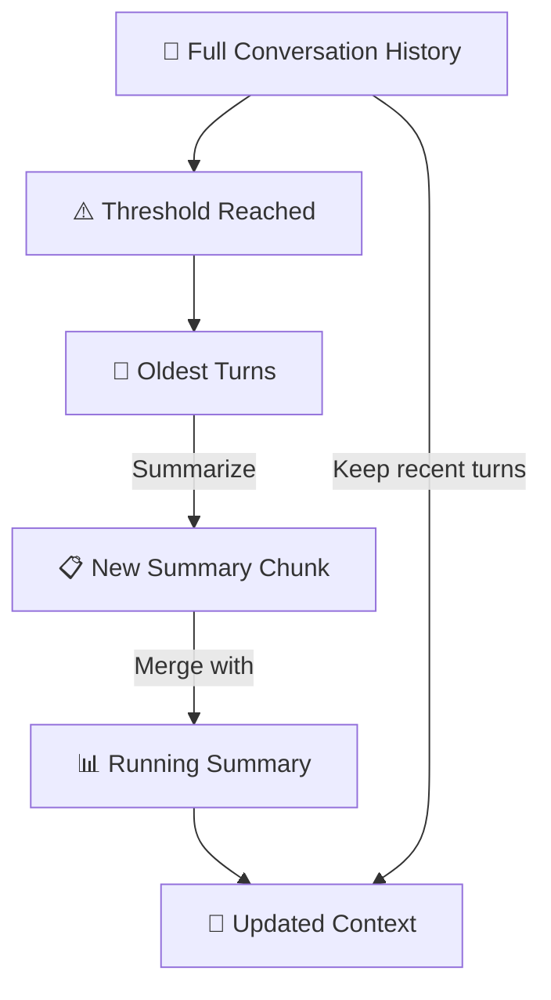

# 2.6 Context Compression

There will always come a moment in an AI application's lifecycle when the context overflows. The conversation has been going on for hours. The user has uploaded three long documents. The agent has accumulated tool results across twenty steps. And the total token count is creeping toward — or past — what the model can handle.

This isn't an edge case. It's a normal part of running AI applications at any meaningful scale. The question isn't whether you'll encounter it, but whether you've thought carefully about what to do when you do.

**Context compression** is the set of techniques for reducing the size of information without losing the signal it contains. Done poorly, it destroys exactly the context that mattered most. Done well, it's nearly invisible — the model continues operating effectively, drawing on the essence of what came before, even though the raw history is no longer in view.

---

## Why Compression Is Hard

The challenge with context compression is that you're trying to make decisions about what information is important before you know what questions are going to be asked. If you knew exactly what the user would need in the next ten messages, you'd know exactly what to keep. You don't.

This makes compression a probabilistic bet. Every compression decision — what to keep, what to summarize, what to discard — is a guess about future relevance. The goal is to make educated guesses, guided by what you know about the user, the task, and the patterns of your application.

There are three broad approaches to context compression, each with different strengths and tradeoffs.

---

## Truncation

The simplest form of compression is **truncation** — cutting off the oldest content when the context gets too long. Usually this means removing the oldest conversation turns, keeping the most recent history while dropping earlier exchanges.

Truncation is easy to implement and has essentially zero computational cost. Its obvious weakness is that it discards information without any judgment about what's valuable. Important decisions made early in a conversation — the user's stated goal, a key constraint, a piece of information they shared — might be lost even though they remain highly relevant to later questions.

A slightly smarter version of truncation uses a **sliding window** approach: instead of keeping the last N tokens, keep the last N turns, but preserve the system prompt and any critical context markers at the top. This prevents the most important instructions from being truncated while still managing history length.

For many applications, truncation with some care about what gets preserved is sufficient. If your conversations are generally short and each turn is relatively self-contained, it often works well enough. The failure mode only becomes significant for longer, more complex interactions where early context remains relevant throughout.

---

## Summarization

A more sophisticated approach replaces older turns not with nothing, but with a **summary**. When the conversation history approaches a length threshold, a background process summarizes the oldest portion into a more compact representation and stores that summary in place of the raw content.

The advantage is obvious: important information doesn't disappear, it gets condensed. The user's goals, the decisions made, the constraints established — all of these can survive in summarized form even after the raw turns have been compressed.

The implementation requires care. A naive summarization — "summarize this conversation" passed to the model — often produces generic output that loses the specific details that matter. Good summarization prompts are structured to extract the particular types of information that your application needs: decisions made, outstanding questions, key facts established, the current state of the task.

One effective pattern is **incremental summarization**: rather than re-summarizing the entire history periodically, maintain a running summary that gets updated each time new content is added. When the history exceeds a threshold, summarize the oldest turns and merge that summary into the existing running summary. This keeps the summary computation small and the result coherent.

---

## Semantic Pruning

The most targeted form of compression is **semantic pruning** — selectively removing content based on its relevance to the current task rather than its age. This is more sophisticated because it requires actually evaluating the content in the context, not just its position.

In practice, this means classifying each piece of context according to some relevance signal. A simple version might check whether each retrieved document chunk is actually cited in the model's responses; if certain chunks are never referenced, they can be dropped from future turns. A more sophisticated version might use a small model or embedding similarity to score each piece of context against the current query and drop anything below a relevance threshold.

Semantic pruning is powerful because it's possible for old content to be highly relevant and recent content to be noise. A user might have mentioned their programming language preference at the very beginning of a conversation and never mentioned it again — that information is old but valuable. Simple truncation would lose it; semantic pruning would keep it.

The tradeoff is computational cost. Evaluating the relevance of every piece of context for every turn adds latency and potentially adds another model call to your pipeline. Whether this is worth it depends on your application's requirements.

---

## What Not to Compress

Equally important to knowing how to compress is knowing **what to protect**. Some content should never be compressed away:

The **system prompt** and core behavioral instructions are almost always in a protected zone. They define the model's behavior and are usually not large enough to be worth compressing anyway.

**Explicit commitments and constraints** that the user established early in a conversation — "I need this for a deadline on Friday," "don't use libraries that require a license," "my company's policy is..." — should be treated as high-value and preserved explicitly, even if the surrounding conversation gets compressed.

**The current task state** — what the agent is currently working on, what steps have been completed, what's still outstanding — is usually the highest-value content in an agent context and should be compressed last, if at all.

---

## The Evaluation Problem

One thing that makes context compression genuinely difficult is that it's hard to evaluate. Did your compression strategy actually preserve the information that mattered? The answer depends on future queries that haven't been asked yet.

The practical approach is to build evaluation datasets that specifically test for information that would have been compressed under your strategy. Craft questions that require recall of early conversation content, apply your compression algorithm, run those questions, and measure whether the model still retrieves the answer correctly. If it does, your compression is working. If it doesn't, you need to adjust what gets preserved.

This is tedious to set up but essential for any application where conversations run long. Without this kind of structured evaluation, you're shipping compression logic on faith — and eventually a user will encounter a failure that makes clear something important was lost.

---

## Compression Is Context Engineering

Context compression sits at the intersection of all the themes in context engineering: you're making deliberate decisions about what information the model should have, managing a token budget, balancing information fidelity against cost, and accepting that every strategy involves tradeoffs.

The right compression strategy depends on your application. Short, transactional conversations probably don't need it at all. Long-running research sessions with many document uploads need aggressive compression to remain viable. Agent workflows that accumulate tool results across many steps need careful state tracking to ensure the agent's working memory stays coherent.

Understanding these tradeoffs — and building compression systems that protect what matters most — is one of the marks of a mature AI engineering practice.
