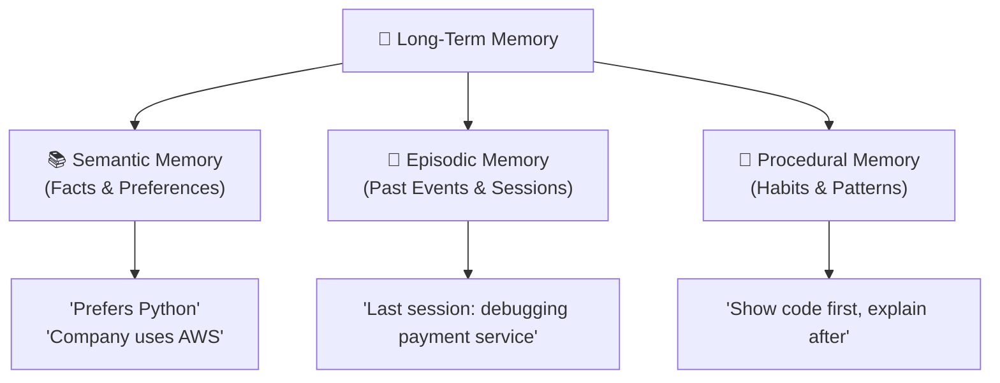

# 2.7 Conversation Memory

Language models are stateless. Every request they receive is, from their perspective, the beginning. They have no concept of yesterday's conversation, no memory of what you asked them last week, no awareness that this is your hundredth interaction with the application. The moment a request completes, the model forgets everything it just produced.

This is one of the most fundamental gaps between what AI systems appear to do and what they actually do. When you use a chatbot that seems to remember your name, your preferences, and the context of your ongoing project, it isn't the model remembering — it's the application doing the remembering and feeding those memories back to the model at the right moment.

**Conversation memory** is the infrastructure behind that illusion. It's the engineering discipline of deciding what to remember, how to store it, and when to retrieve it — so that users experience an assistant that actually knows them over time.

---

## Short-Term Memory: The Active Context Window

The simplest form of memory in an AI application is the conversation history that's included in the current prompt. When you include the last several turns of a dialogue in the context, the model can refer back to what was said, understand follow-up questions, and maintain continuity within a single session.

This is **short-term memory** — the model's working memory for the current conversation. It exists entirely within the context window. The moment the conversation ends, or the window fills up and old turns are removed, that information is gone.

For many applications, short-term memory alone is sufficient. A customer support chatbot that handles isolated, transactional conversations doesn't need to remember anything between sessions. What happened in one ticket is irrelevant to the next one.

But as AI applications become more personal and more capable, short-term memory becomes insufficient. Users don't want to re-explain their situation every time they start a new session. An AI coding assistant should know which languages you prefer, which patterns you find unreadable, which libraries your project uses. A writing assistant should know your voice, your style, the project you're working on. Building that kind of continuity requires a different kind of memory.

---

## Long-Term Memory: What Persists Across Sessions

Long-term memory is information that the application stores externally and retrieves as needed — across sessions, over days or weeks or months. This is where the real complexity lives, because memory is not a single concept. What you need to remember, how you store it, and how you retrieve it depends on the type of information involved.

Researchers and engineers who work on AI memory systems often borrow a classification from cognitive science, distinguishing between three kinds of long-term memory:

**Semantic memory** stores facts, preferences, and stable knowledge about the user or the domain. "The user prefers Python over JavaScript." "The company's fiscal year ends in March." "This user is a senior engineer who finds basic explanations condescending." These are relatively stable pieces of information that remain relevant across many different conversations.

**Episodic memory** stores specific events and past interactions. "Last Tuesday, the user asked about debugging a memory leak and we worked through it together." "In the previous session, the user was trying to refactor a payment service." These are more contextual and may become less relevant over time, but they're important when they're relevant — knowing what someone was working on last time dramatically reduces the setup cost of getting back into a project.

**Procedural memory** stores learned behaviors and patterns. "This user prefers code examples over abstract explanations." "When asked about architecture decisions, this user wants tradeoffs first, implementation second." These are habits and styles that improve interaction quality without requiring the user to re-specify their preferences every session.

---

## How Memory Systems Are Implemented

In practice, memory is implemented using a combination of database technologies chosen for their access patterns.

For **semantic memory** — facts and preferences that need fast lookup by key — a simple key-value store or a relational database often works well. You're looking up "what does this user prefer about X" and getting a direct answer.

For **episodic memory** — past conversations and events that need to be retrieved based on relevance to the current topic — a vector database is typically the right tool. You encode past interactions as embeddings, then retrieve the most semantically similar past episodes based on what the user is currently asking about. This way, the system surfaces relevant history even when the user doesn't explicitly ask for it.

The retrieval step is where memory becomes context engineering. When a new request arrives, the application runs a retrieval pass against the memory store, selects the most relevant items, and injects them into the context before the model sees the request. From the model's perspective, it has simply been given information about the user. From the user's perspective, the system "remembers."

---

## The Write Problem: What's Worth Remembering

One of the harder engineering problems in memory systems is deciding **what to write**. Not every interaction contains information worth persisting. But the system needs to identify, in or after each interaction, what should be extracted and stored.

This is usually done through a structured extraction step — after or during a conversation, a prompt asks the model to identify facts that should be remembered: preferences expressed, decisions made, ongoing projects mentioned, constraints established. The extracted facts are then stored in the memory system for future retrieval.

The quality of this extraction step matters enormously. If it's too aggressive, you end up storing everything and retrieval becomes noisy. If it's too conservative, useful information slips through. Most production systems tune this step carefully using their application's specific patterns: what kinds of facts does our application actually need to remember?

---

## Memory and Privacy

Memory systems introduce a dimension that pure prompt engineering doesn't: **persistent personal data**. Storing information about users across sessions means you're managing sensitive information with real obligations.

This isn't just a philosophical concern. In many jurisdictions, storing user preferences and interaction history creates legal obligations around data retention, deletion, and user access. Users should be able to see what the system knows about them, correct inaccuracies, and request deletion.

These requirements shape how memory systems are architected. Memory data needs to be stored in ways that support retrieval by user identifier, deletion on request, and audit logging of what was written and when. This is additional engineering complexity that demos don't require but production systems do.

---

## The Experience Memory Creates

Done well, memory is one of the most impactful things you can add to an AI application. The difference between an assistant that treats every conversation as a fresh start and one that genuinely knows you is dramatic — not just in convenience, but in the quality of help it can provide.

When the system knows your preferences, it can make better recommendations. When it remembers your ongoing projects, it can pick up where you left off. When it has learned your patterns, it anticipates what you need without requiring you to specify it.

This is what it looks like when context engineering matures — when information isn't just assembled from the current request, but drawn from a rich history of everything the system has learned about this user over time. The model is still stateless. The application is not.

That distinction — maintaining state at the application level so the model can behave as if it has state — is one of the defining architectural patterns of production AI systems.
