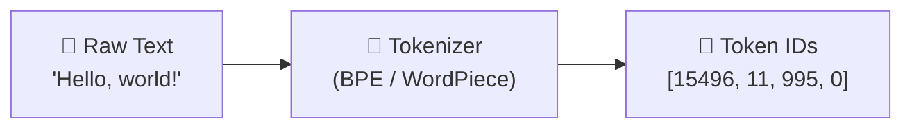

# 3.1 Tokenization

Everything that happens inside a language model begins with a deceptively simple question: how do you turn text into numbers?

Language models don't read words. They don't read characters. They process tokens — a specific kind of unit that sits somewhere between the two — and they process them as integers, not text. The process of converting your prompt into that sequence of integers is called **tokenization**, and it has more practical consequences for how you build AI applications than most developers initially realize.

---

## Why Not Just Use Words or Characters?

The two obvious choices for representing text numerically are words and characters. Both have serious problems.

Word-level tokenization — where each word in the vocabulary gets its own integer — requires a massive vocabulary to cover even a moderate portion of written English, let alone code, scientific notation, names, and languages that form words differently. Rare words and new terms simply can't be represented, because they were never assigned an ID.

Character-level tokenization — one integer per character — keeps the vocabulary tiny but makes sequences very long. A sentence of twenty words might be ninety or a hundred characters. Processing sequences that long through dozens of attention layers is computationally expensive, and individual characters carry very little semantic meaning on their own.

The solution that modern LLMs converge on is **subword tokenization**: breaking text into pieces that are larger than individual characters but smaller than full words. Frequently used words get their own single token. Rare or unusual words get split into recognizable subword pieces. Nothing is completely unrepresentable.

---

## How BPE Works

The most widely used algorithm is **Byte Pair Encoding (BPE)**, which is used by GPT-4, Claude, LLaMA, Gemini, and many others.

BPE starts from the ground level. During training, the tokenizer begins with individual bytes — the smallest possible units, 256 in total. It then scans the entire training corpus and finds the most frequently occurring pair of adjacent bytes. Those two bytes get merged into a single new token. The process repeats: find the most frequent pair, merge it, add it to the vocabulary. This continues until the vocabulary reaches a target size, typically somewhere between 32,000 and 100,000 tokens.

The result is a vocabulary where common English words like "the," "and," "is" are single tokens; less common words might be split into two or three pieces; and very unusual strings like obscure proper nouns or code-specific syntax get broken down further.

A few examples to make this concrete. The word "tokenization" might be a single token if it appeared frequently enough in training data. The word "antidisestablishmentarianism" would almost certainly be split into several subword tokens. And a programming variable name like `connectionTimeoutMilliseconds` would be split based on the specific character patterns the tokenizer learned.

---

## WordPiece and SentencePiece

**WordPiece** is a close cousin of BPE, used primarily by BERT and its derivatives. The core idea is similar — build a vocabulary of subwords — but the merge criterion differs. Rather than always merging the most frequent pair, WordPiece merges the pair that maximizes the probability of the training data under the current vocabulary. This leads to slightly different vocabulary distributions, but the practical behavior for most applications is similar.

**SentencePiece** is not an algorithm so much as a framework that implements BPE or another method called Unigram while treating whitespace as just another character. Most tokenizers split on word boundaries first — spaces tell them where words end and begin. SentencePiece doesn't make that assumption. It processes raw text as a continuous stream of bytes, which makes it more naturally suited for languages that don't use spaces as word separators, like Japanese or Chinese.

---

## The Practical Consequences for Engineers

Tokenization isn't just an implementation detail you can ignore. It has real effects that show up in day-to-day AI engineering work.

**Token count is not word count.** When you're calculating how much context you have left in a window or estimating API costs, you need to think in tokens, not words. A rough rule of thumb is that English prose tokenizes at roughly 0.75 words per token — so a thousand words is about 750 tokens. But this varies significantly. Code tends to be more token-dense than prose. Languages other than English may tokenize less efficiently, with some non-Latin scripts requiring two or three tokens per character.

**Splitting at unexpected boundaries creates surprises.** Tokenizers split text in ways that aren't always intuitive. Arithmetic on numbers often fails because numbers get split into digit tokens that the model doesn't naturally treat as numerical quantities. Unusual variable names in code may get split in the middle of meaningful substrings. Proper nouns, technical jargon, and anything outside the training distribution may fragment unexpectedly.

**The tokenizer is model-specific.** You can't use GPT-4's tokenizer with a Claude model or vice versa. Each model family has its own vocabulary, trained on its own corpus. If you switch models, you may find that the same text tokenizes to different lengths, which can push you over or under context window limits you were previously comfortable with.

---

## Tokenization Edge Cases Worth Knowing

A few tokenization behaviors trip up developers who haven't encountered them before.

**Leading spaces matter.** Most tokenizers treat " hello" (with a leading space) as a different token than "hello" (without one). This matters when you're concatenating strings programmatically — a subtle missing space can split what you intended to be a single token into two.

**Numbers don't tokenize as numbers.** The number "12345" isn't a single token — it gets split into something like "123" and "45", or individual digits, depending on the tokenizer. This is one reason LLMs have historically struggled with arithmetic. They're not computing on numbers; they're predicting the next character-level fragments of a digit sequence.

**Some languages are expensive.** A sentence in Chinese or Arabic may take three or four times as many tokens as the equivalent English sentence, because the tokenizer's vocabulary was built primarily on English text. This has real cost implications for multilingual applications.

**Control tokens are invisible but real.** Most models use special tokens to mark the beginning of the sequence, the end, the boundary between user and assistant turns, and other structural elements. These aren't visible in the text you write, but they consume tokens, and understanding them is important when working close to context limits.

---

## The Starting Point of Everything

Tokenization is the very first step in every inference request, and it sets the stage for everything that follows. The model never sees your text as you wrote it — only as the sequence of integers that text maps to. Understanding how that mapping works, where it's efficient, and where it creates surprises gives you a meaningful advantage in building and debugging AI applications.

When something strange happens — an unexpected token limit error, arithmetic that goes wrong, a model that handles English and French differently — the answer is often found in the tokenizer.
