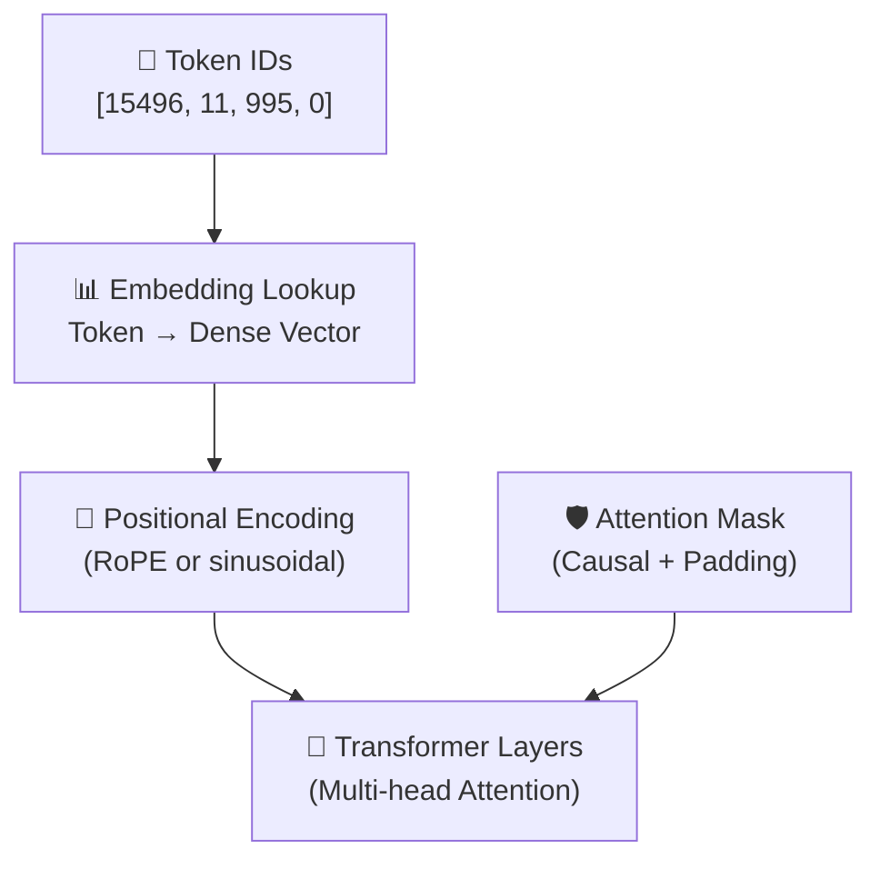

# 3.2 Prompt Encoding

After the tokenizer converts your prompt into a sequence of integer IDs, those integers still can't be fed directly into the model's neural network. The network operates on continuous numerical vectors — high-dimensional spaces where mathematical operations like addition and matrix multiplication carry meaning. The transition from integer IDs to those vectors is what we call **prompt encoding**, and it's where text stops being text and starts being something a neural network can actually work with.

---

## From Token IDs to Vectors

Every token in the vocabulary has a corresponding vector in a learned **embedding table** — a large matrix where each row represents one token. When the tokenizer produces an integer ID, the first thing the model does is look up that integer's row in the embedding table and retrieve its vector.

These vectors aren't random. They're learned during model training through exposure to enormous amounts of text, and they encode relationships between tokens in a way that's geometrically meaningful. Tokens with related meanings end up near each other in the embedding space. Tokens that appear in similar contexts develop similar vector representations.

The resulting embedding for a typical production model is quite large — often 1,024, 2,048, 4,096, or even 8,192 dimensions per token, depending on the model size. A prompt that tokenizes to 500 tokens becomes a matrix of shape `500 × 4096`, which is what actually flows into the transformer's attention layers.

---

## Positional Encoding: Teaching the Model About Order

There's a fundamental challenge with processing all tokens through embedding lookup: the process is the same for every token, regardless of where it appears in the sequence. The vector for "cat" at position 3 looks identical to the vector for "cat" at position 47. But position matters. "The cat chased the dog" and "The dog chased the cat" use the same tokens in different orders and mean different things.

To solve this, transformers add **positional information** to each token's embedding before it enters the attention layers. This is called **positional encoding**.

Early transformers like the original BERT used fixed mathematical functions — sine and cosine waves of different frequencies — to generate a unique positional signal for each position. These signals were added directly to the token embeddings.

Modern decoder-only LLMs (GPT, LLaMA, Claude) typically use **Rotary Position Embeddings (RoPE)** or a similar learned approach. Rather than adding a position signal, RoPE encodes relative position information directly into the attention computation — specifically into how the query and key vectors relate to each other. This has a practical advantage: models trained with RoPE generalize better to sequence lengths longer than those seen during training, which is important as context windows expand.

The key thing to understand is that after positional encoding, each token's representation carries both its semantic content (from the embedding) and its position in the sequence. The model knows not just what each token is, but where it sits relative to all the others.

---

## Attention Masks

Along with the embedded token sequence, the model also receives an **attention mask** — a matrix that controls which tokens are allowed to attend to which other tokens.

In a decoder-only model (which is what most chat LLMs are), there's a strict rule: a token can only attend to tokens that came before it in the sequence. It cannot look ahead at future tokens. This is enforced through a **causal mask**, sometimes called an autoregressive mask — a triangular matrix where positions above the diagonal are blocked.

Why does this matter? Because it's what makes the model's training valid. During training, the model processes an entire sequence at once, but the causal mask ensures that each token's prediction is based only on the tokens that would actually have come before it at generation time. Without this mask, the model could "cheat" by attending to the answer it's being asked to produce.

At inference time, causal masking is still applied — each newly generated token can attend to all previous tokens in the sequence but not to tokens that haven't been generated yet.

There's a second kind of mask that matters in practice: the **padding mask**. When multiple requests are processed together in a batch, shorter sequences get padded with placeholder tokens to match the length of the longest sequence. The padding mask tells the model to ignore those placeholder tokens, so they don't contaminate the attention computation.

---

## What the Transformer Actually Receives

Putting it all together: by the time a prompt enters the first transformer layer, it exists as a three-dimensional tensor — a stack of dense vectors, one per token, each carrying both semantic content and positional information, accompanied by a mask matrix that defines the attention boundaries.

The transformer's self-attention mechanism then takes this representation and allows each token to gather information from every other token it's allowed to attend to. This happens through the computation of **query, key, and value** matrices — projections of the token embeddings that determine how much attention each token pays to every other. The result of this attention is a new representation for each token that incorporates context from across the sequence.

Crucially, this happens in parallel across all tokens during the prefill phase. Every token in your prompt is processed simultaneously, each building a representation that's informed by all the tokens around it. It's this parallel processing that makes the prefill phase computationally intensive — you're performing large matrix multiplications across the entire prompt length at once.

---

## Why This Matters for Application Engineers

You don't need to implement any of this to build AI applications. But understanding it explains several things that would otherwise seem arbitrary.

It explains why the model doesn't treat "12" as the number twelve — it's two embedding vectors, one for "1" and one for "2," with no inherent numerical relationship between them. It explains why swapping two words in a sentence can dramatically change the model's output even when the words are synonyms — their positional embeddings are different, which changes how attention flows through the network. It explains why very long prompts take longer to process even when the content is straightforward — the attention computation scales with sequence length.

Most importantly, it provides intuition for what happens when the context window is nearly full. The model isn't running out of storage space like a hard drive. It's operating on increasingly long sequences through attention layers that are processing every token-to-token relationship in that sequence. The computational cost of prompt encoding grows with the square of the sequence length in standard attention — which is why optimizations like flash attention, sparse attention, and ring attention matter so much in production inference systems.

Encoding is where language becomes geometry. Everything else in the inference pipeline — prefill, decoding, sampling — operates in that geometric space.
