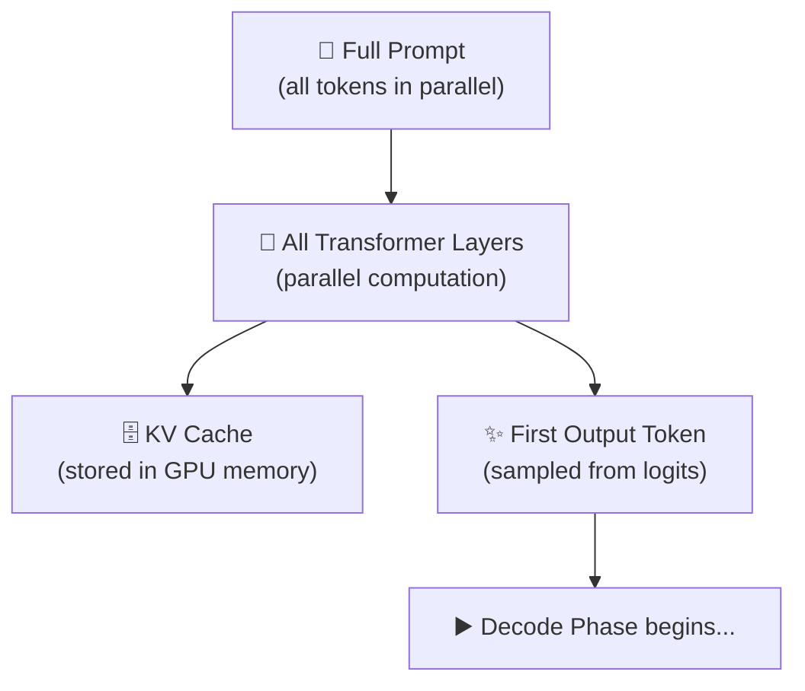

# 3.3 The Prefill Phase

When you send a request to a language model, the model's work begins well before it generates the first word of its response. Before any output is produced, the model has to process your entire prompt — every token in it, through every transformer layer. This is the **prefill phase**, and it represents the most computationally intensive part of the inference pipeline.

Understanding what happens during prefill, and why it works the way it does, has direct implications for how you think about latency, cost, and the architecture of production AI systems.

---

## What Happens During Prefill

The prefill phase takes your encoded prompt — the sequence of embedding vectors that represent your input — and processes it through every layer of the transformer, simultaneously, in parallel.

"In parallel" is the key phrase. Every token in the input is processed at the same time. Rather than working through tokens one at a time, the attention mechanism computes relationships between all token pairs simultaneously, across all transformer layers. This is what makes modern GPU hardware well-suited for this task: GPUs excel at large matrix multiplications, and processing an entire sequence in parallel translates directly into that kind of computation.

The output of the prefill phase is two things. First, the **Key-Value (KV) cache** — a memory structure that stores intermediate representations for every input token, which the model will reuse throughout the generation phase so it doesn't have to recompute them. Second, the **first output token** — a probability distribution over the vocabulary from which the model samples what to say first.

---

## The KV Cache: The Bridge to Decoding

To understand why the KV cache matters, you need to understand what would happen without it.

In a transformer, generating each new token requires computing attention — which means each new token needs to "look at" every previous token and calculate how much to attend to it. If the model had to recompute the Key and Value vectors for every previous token on every single step of generation, the computational cost would scale catastrophically. For a prompt of a thousand tokens and a response of two hundred tokens, you'd be redoing the same work thousands of times.

The KV cache prevents this. During prefill, the model computes Key and Value vectors for every input token and stores them in fast GPU memory. During the decode phase that follows, each newly generated token can look up the stored KVs for all previous tokens rather than recomputing them. Generation stays efficient even as the sequence grows long.

The tradeoff is memory. The KV cache for a single long sequence can be substantial — a long conversation on a large model might require gigabytes of GPU memory just for the cache. This is why memory management is one of the central engineering challenges in LLM inference infrastructure, and why tools like **vLLM** (which introduced PagedAttention to manage KV cache memory the way an operating system manages RAM) have become important in production deployments.

---

## Prefill is Compute-Bound

A useful distinction in AI infrastructure is between workloads that are **compute-bound** (limited by raw processing power) and those that are **memory-bandwidth-bound** (limited by how fast data can be moved in and out of memory). Prefill is compute-bound.

Processing the entire prompt in parallel involves enormous matrix multiplications — multiplying large weight matrices against the sequence representation, across every transformer layer. Modern GPUs are designed for exactly this kind of work. The FLOPs (floating-point operations) required scale roughly with the product of prompt length and model size. A longer prompt requires more computation; a larger model requires more computation.

This is why **Time to First Token (TTFT)** — the latency between when you send your request and when the first character of the response appears — grows with prompt length. A short prompt with a few hundred tokens might prefill in milliseconds. A prompt filling a hundred-thousand token context window might take several seconds to prefill, even on high-end infrastructure. When you're designing systems where responsiveness matters, this is a real constraint.

---

## Prompt Caching

One of the most practically significant optimizations in modern LLM inference is **prompt caching** — the ability to save and reuse the KV cache from a previous prefill computation.

The idea is simple: if a large portion of your prompt is identical across multiple requests (which is often true for the system prompt, tool definitions, or large knowledge bases), you don't need to recompute the prefill for those tokens on every request. You can compute it once, cache the KV representations for those tokens, and reuse that cache for subsequent requests that share the same prefix.

Several inference providers and serving frameworks support this. Anthropic's API offers explicit cache control. OpenAI automatically caches prompt prefixes. Self-hosted deployments using vLLM or similar frameworks can be configured to share KV cache across requests with common prefixes.

For applications with long, stable system prompts or repeated document retrieval, prompt caching is one of the highest-leverage optimizations available — reducing both latency and cost for the cached portions by orders of magnitude.

---

## Prefill Optimization in Production

At high traffic scale, managing prefill efficiently becomes a significant infrastructure concern. Some approaches worth knowing:

**Continuous batching** allows a serving system to process requests together in a batch even when they arrive at different times, rather than waiting for a full batch to form. During prefill, this means multiple prompts can be processed together, improving GPU utilization.

**Chunked prefill** breaks very long prompts into smaller pieces that are processed sequentially, rather than all at once. This prevents a single very long prompt from monopolizing the GPU and degrading latency for other requests in the queue.

**Speculative decoding** is a different kind of optimization that uses a small draft model to speculatively generate candidate tokens during decode, but it has implications for how the prefill phase is structured to verify those candidates efficiently.

---

## The End of Prefill

When prefill completes, the model has done its most expensive work. The KV cache is populated, the first token is ready, and the inference pipeline transitions to the decode phase — where generation happens one token at a time.

From the application's perspective, the moment prefill ends is the moment the user sees the first character of the response. Everything before that is waiting. Everything after is streaming. That transition — prefill ending, decode beginning — is one of the most consequential events in the lifecycle of every AI request.
