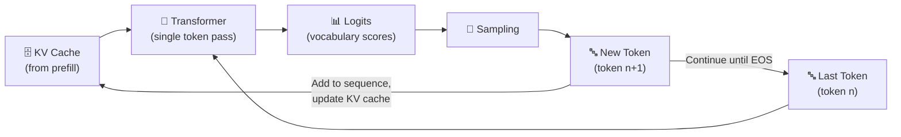

# 3.4 The Decode Phase

After prefill completes — after the model has processed your prompt, built the KV cache, and produced its first token — a very different kind of computation begins. The decode phase is where the response is actually generated, one token at a time, in a tight loop that continues until the model decides it's done.

Understanding how decoding works — and how it differs from prefill — is essential for reasoning about inference latency, throughput, and the tradeoffs that matter when you're building or running AI systems at scale.

---

## Autoregressive Generation

Language models generate text **autoregressively**: each token is predicted based on all the tokens that came before it. There's no way to parallelize this across output tokens. Token 2 depends on Token 1. Token 3 depends on Tokens 1 and 2. The sequence is inherently sequential.

This is the defining characteristic of the decode phase. Where prefill processes the entire input simultaneously, decode produces output one step at a time. Each step involves running the newly generated token through all the transformer layers, computing its attention against the KV cache of all previous tokens, and producing a probability distribution over the vocabulary. A token is selected from that distribution, added to the sequence, and the process repeats.

At each decode step:
1. The last generated token is embedded and passed through the transformer
2. The model attends to all previous tokens via the KV cache (without recomputing their representations)
3. The final layer produces **logits** — a vector of unnormalized scores, one per vocabulary entry
4. The logits are converted to probabilities via softmax
5. A sampling strategy selects the next token from that distribution
6. That token is appended to the sequence and the loop continues

The loop ends when the model generates a special end-of-sequence token, or when the output reaches a maximum length limit set by the application.

---

## Decoding is Memory-Bandwidth-Bound

This is one of the most important distinctions between prefill and decode, and it has significant practical implications.

Prefill is compute-bound — it involves enormous matrix multiplications that saturate the GPU's processing cores. Decode is **memory-bandwidth-bound** — it's limited by how fast the GPU can move data in and out of memory, not by how fast it can compute.

Here's why. At each decode step, the model needs to load all of its weight matrices through the computation — the same process as prefill, but now for just a single token rather than hundreds. The ratio of data transferred (all the weights) to actual computation (a single token's forward pass) is much lower than during prefill. The GPU's compute capacity is underutilized; it's spending most of its time waiting for data to arrive from memory.

This matters when you're optimizing for **throughput** — how many tokens per second a serving system can produce across all its users. Increasing batch size during decode (processing multiple requests simultaneously) is the primary way to improve GPU utilization during this phase, because it amortizes the cost of loading the model weights across more tokens at once.

---

## The Growing KV Cache

One consequence of autoregressive decoding that's worth understanding is that the KV cache grows with every step. At the start of decode, the cache holds the representations for all input tokens. By the end of a long response, it holds representations for all input tokens plus every generated output token.

For very long responses, this can become a significant memory concern. A response of several thousand tokens on a large model can add multiple gigabytes to the KV cache. Serving systems need to manage this memory carefully, especially when they're handling many concurrent requests with long contexts.

**PagedAttention**, the memory management technique introduced by vLLM, addresses this by allocating KV cache memory in pages — small, fixed-size blocks — rather than as a single contiguous allocation. This allows the serving system to reuse freed memory across requests, avoid fragmentation, and support many more concurrent long-context requests than a naive allocation strategy would permit.

---

## Stopping Conditions

The decode loop doesn't continue indefinitely. Several conditions can terminate generation:

**End-of-sequence token**: Every model has a special token that signals "I'm done." When the model samples this token, generation stops. The model learns during training to produce this token at the end of naturally completed responses.

**Maximum token limit**: Applications and users can set an explicit maximum number of output tokens. This is a hard ceiling that prevents runaway generation and provides cost predictability. A response that hits the max token limit is typically truncated, which can result in incomplete outputs — an important edge case to handle in your application.

**Stop sequences**: Many APIs support "stop sequences" — specific strings that, when generated, cause the inference server to terminate generation immediately, even if the model would have continued. These are useful for structured outputs where you need the response to end at a specific delimiter, like a closing JSON brace or a section marker.

---

## Latency Metrics That Matter

The decode phase is responsible for two of the most important latency metrics in production AI systems.

**Time per Output Token (TPOT)** measures how long each individual decode step takes. It determines how quickly text streams to the user after the first token appears. A TPOT of 50ms means the user sees twenty tokens per second — fast enough to read comfortably. A TPOT of 200ms produces a noticeable stutter.

**Total Generation Latency** is the sum of prefill latency (TTFT) plus decode latency (TPOT × number of output tokens). This is the total time the user waits from sending the request to receiving the complete response when streaming isn't used.

Optimizing these metrics requires different approaches. TTFT optimization focuses on prefill — shorter prompts, prompt caching, faster hardware. TPOT optimization focuses on the decode loop — higher batch utilization, quantization, hardware that excels at memory bandwidth, and techniques like speculative decoding that can generate multiple tokens per step.

---

## Decoding and User Experience

From the user's perspective, the decode phase is the part of inference they experience most directly. The typewriter effect of streaming text — one token appearing after another — is the visible surface of the decode loop running in real time.

This is why the streaming infrastructure described in the next section matters so much. The decode loop produces tokens. The streaming layer delivers them. The user's perception of latency, responsiveness, and reliability is shaped almost entirely by what happens at this boundary.

Getting decode right — in terms of efficiency, stopping behavior, and streaming delivery — is what separates AI systems that feel fast and reliable from those that feel sluggish or unpredictable.
