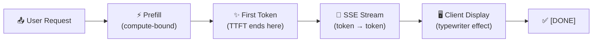

# 3.5 Streaming Tokens

There's a moment in using an AI application that changes everything about how the experience feels: the moment text starts appearing before the response is finished. The cursor blinks, the first word appears, then another, then another — a steady stream of output that arrives as it's generated rather than all at once.

This is **token streaming**, and it's not just a visual flourish. It's one of the most consequential engineering decisions in how AI applications are presented to users, with measurable effects on perceived performance, user satisfaction, and the practical usability of long responses.

---

## Why Streaming Exists

Without streaming, an inference request works like a traditional API call: you send a request, the server processes it completely, and when every token of the response has been generated, the entire response is returned. For short responses, this is fine. For longer ones — a detailed analysis, a code file, a multi-paragraph explanation — users might wait five, ten, or twenty seconds staring at a blank screen before anything appears.

Human attention is poorly suited for that kind of wait. Research on interface responsiveness suggests that users begin to disengage when nothing visible happens for more than a second. In practice, long waits before first output lead to higher drop-off rates, more "is this thing working?" uncertainty, and a general sense that the system is unreliable.

Streaming solves this by making the response progressive. The server begins sending tokens as soon as the decode loop produces them — one at a time, or in small batches — and the client displays them as they arrive. The total time from request to complete response is exactly the same. But the time from request to *first visible output* can drop from many seconds to under a second, and that difference is enormous for user experience.

---

## How Streaming Works: Server-Sent Events

The dominant protocol for token streaming in web applications is **Server-Sent Events (SSE)**. It's a simple, elegant solution for what is fundamentally a one-way push problem: the server generates tokens, the client needs to receive them in real time, and there's no meaningful data flowing from client to server during this process.

SSE works over a persistent HTTP connection. The server keeps the connection open and pushes data chunks to the client as they become available. Each chunk is formatted as a simple text message, and the client's browser or library receives these messages and processes them as they arrive.

All the major AI providers use SSE for streaming — OpenAI, Anthropic, Google, and virtually every serious API. The wire format differs slightly between providers, but the underlying mechanism is the same.

A typical streaming response from an AI API looks something like a series of JSON delta events, each containing one token or a small group of tokens:

```
data: {"delta": {"type": "text_delta", "text": "The"}}
data: {"delta": {"type": "text_delta", "text": " key"}}
data: {"delta": {"type": "text_delta", "text": " insight"}}
data: {"delta": {"type": "text_delta", "text": " is..."}}
data: [DONE]
```

The client receives these events in order, extracts the text from each delta, and appends them to whatever display element is showing the response. From the user's perspective, text appears to be "typing out" in real time.

---

## Time to First Token: The Metric That Matters Most

The user experience of streaming lives or dies on a single metric: **Time to First Token (TTFT)** — the duration between sending the request and receiving the first token of the response.

TTFT determines whether the experience feels responsive or sluggish. If the first token arrives in under a second, users perceive the system as fast, even if the complete response takes ten more seconds to stream. If the first token takes three seconds, users feel stuck, even if the response streams quickly after that.

TTFT is primarily determined by prefill latency — how long it takes to process the input prompt. This means that the best ways to reduce TTFT are: using shorter prompts, using prompt caching to avoid re-prefilling stable content, using faster hardware or more specialized inference backends, and reducing queueing time on busy inference servers.

A secondary factor is network infrastructure. If your API gateway, load balancer, or reverse proxy buffers response data before forwarding it to the client, streaming is silently defeated — the first token arrives at the gateway but waits until there's a full buffer to forward. Streaming-aware infrastructure must be configured to flush buffers immediately, not accumulate them.



---

## Streaming and Intermediate Reasoning

A pattern that's become more common as models with extended reasoning capabilities have emerged is **streaming through thought**. Models that reason before responding — working through intermediate steps, considering alternatives — can stream that reasoning to the user before presenting a final answer.

This creates an interesting tension. Showing reasoning can increase transparency and trust. But it also means the user sees the model working through ideas that may be discarded, corrected, or revised. Different applications handle this differently: some stream everything, some hide reasoning and stream only the final response, some allow users to toggle between modes.

The technical mechanism is the same regardless — SSE events delivered in order — but the application layer has to decide what to surface and what to filter.

---

## Handling Streaming on the Client

Building a client that handles streaming well involves a few considerations beyond simply receiving events and appending text.

**Backpressure** is the situation where the client can't display tokens as fast as the server sends them. In practice this is rarely a bottleneck — rendering text is far faster than any model generates it — but applications that perform processing on each token (formatting, rendering markdown, parsing structured output) need to ensure this processing doesn't block the receive loop.

**Connection resilience** matters for longer responses. SSE connections can be interrupted by network blips, timeouts, or infrastructure restarts. Well-built applications handle reconnects gracefully — either resuming a stream from where it left off (if the server supports it) or communicating clearly to the user that a retry is needed.

**Partial output handling** is important for any application that does something with the final, complete response. If the connection drops after 60% of a response is received, the application needs to decide: is partial output usable? Should it retry the request? Should it surface an error?

---

## The Experience Streaming Creates

There's something psychologically interesting about streaming that goes beyond the latency numbers. When text appears progressively, users are drawn into the response as it forms. They begin reading before the answer is complete. They form interpretations and expectations mid-stream, which the model then confirms or revises. The interaction feels more like a conversation with a person thinking through an answer than a database query returning a result.

This is not an accident. Streaming is one of the primary ways that AI interfaces create a sense of responsiveness and presence — the feeling that something intelligent is working in real time, rather than a server returning a pre-computed result. Getting it right is part of what makes the difference between an AI product that feels alive and one that feels mechanical.
