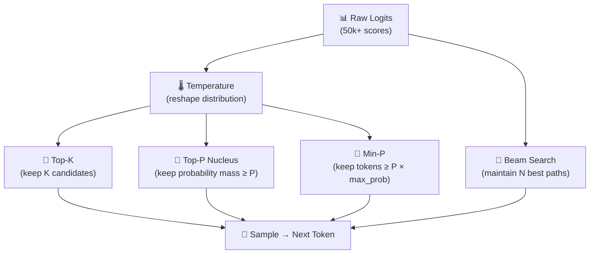

# 3.6 Sampling Strategies

At the end of each decode step, the model produces a probability distribution — a score for every token in its vocabulary, representing how likely that token is to be the right next token given everything that came before. The vocabulary might have 50,000 or 100,000 entries. Most of them have negligible probability. A handful have meaningful probability. And the model has to pick one.

How you make that selection is what **sampling strategies** are about. The choice isn't neutral. Sample too conservatively and the model becomes predictable, repetitive, and brittle. Sample too freely and you get nonsense — a creative but incoherent word salad. Different tasks need different points on this spectrum, and understanding the tools available to you is what lets you dial this in correctly.

---

## The Starting Point: Temperature

Temperature is the first parameter most people encounter, and it's the most conceptually important. It doesn't change which tokens are available — it changes the shape of the probability distribution before sampling happens.

At **temperature 0**, the distribution is perfectly sharp: probability 1 on the most likely token, 0 on everything else. The model always picks the most likely next token. This is called greedy decoding, and it's deterministic — the same prompt always produces the same output. It's ideal for tasks where there's a clearly correct answer: structured data extraction, code generation with specific requirements, factual lookups.

As temperature increases — to 0.5, 0.7, 1.0, higher — the distribution flattens. Tokens that had moderate probability get more of a chance. Tokens that had low probability get a slightly elevated chance. The model becomes more willing to explore less obvious paths. At temperature 1.0, you're sampling from the model's raw distribution. Above 1.0, things get progressively more random and eventually incoherent.

A useful mental model: temperature is the difference between a journalist who only states verified facts (temperature near 0) and a novelist generating associations freely (temperature near 1). Most applications live somewhere in the middle — creative enough to be useful, constrained enough to be trustworthy.

---

## Top-K: Cutting the Tail

Even at moderate temperatures, the long tail of the probability distribution contains tokens that are essentially noise — words that have vanishingly small probability but could theoretically be selected. Top-K sampling eliminates this by restricting the selection pool to the K most probable tokens before sampling.

If K is 40, the model can only choose from the forty most likely next tokens. The probabilities of those forty are renormalized to sum to 1, and sampling proceeds normally within that set.

The advantage is that you cut off the nonsensical low-probability options entirely. The disadvantage is that K is a fixed number regardless of the situation. When the model is very confident — one token has 90% probability and the rest share the remaining 10% — restricting to K=40 still allows 39 unlikely tokens to compete. When the model is very uncertain — fifty tokens each have roughly 2% probability — K=40 might be too restrictive, cutting off legitimate options.

This context-blindness is the reason Top-K has largely given way to more adaptive approaches.

---

## Top-P: Nucleus Sampling

Top-P (often called nucleus sampling) takes a smarter approach. Instead of fixing the number of tokens to sample from, it fixes the total probability mass that the candidate pool should contain.

With Top-P = 0.9, you include the smallest set of tokens whose cumulative probability adds up to at least 0.9. If the model is confident, this might be just three or four tokens. If the model is genuinely uncertain between many reasonable options, this might be twenty or thirty. The pool adapts dynamically to the model's confidence level.

This adaptive behavior makes Top-P substantially more robust across different situations than Top-K. It's the default sampling method in most production settings and APIs, and it tends to produce better results with less tuning.

A practical note: temperature and Top-P both control the breadth of sampling, but in different ways. When both are set, they interact — and their combined effect is harder to reason about than either alone. The common production guidance is: **tune one or the other, not both**. If you want a direct dial over randomness, use temperature alone. If you want uncertainty-adaptive sampling, set temperature to 1 and adjust Top-P.

---

## Min-P: A Newer Approach

Min-P is a more recent addition to the sampling toolkit, and it offers a cleaner conceptual model than either Top-K or Top-P.

Rather than defining a fixed K or a cumulative probability threshold P, Min-P filters tokens based on their probability relative to the most probable token. If the most likely token has probability 0.6 and Min-P is 0.1, only tokens with probability at least 0.06 (10% of 0.6) make the candidate pool.

The elegance of this approach is that the threshold scales with the model's confidence. When the model is very sure about one token, the bar for inclusion is high — only tokens that are at least 10% as likely as the top choice qualify. When the model is genuinely uncertain — the top token has probability 0.05, say — the bar is correspondingly low, allowing many candidates into the pool.

Many practitioners who have tried Min-P find it produces better results across a wider range of prompts than Top-K or Top-P, with less parameter tuning required. It's increasingly available in open-source inference frameworks and is worth experimenting with.

---

## Beam Search

Beam search takes a fundamentally different approach to the selection problem. Rather than sampling a single next token at each step, it maintains multiple candidate sequences — called beams — and extends each of them at every step, keeping only the highest-scoring partial sequences.

With a beam width of 5, the model tracks the top 5 partial response sequences simultaneously. At each step, each of the 5 beams generates candidates for the next token, producing 5 × vocabulary_size options. The system keeps the top 5 overall sequences by their cumulative log-probability, and the process continues until all beams hit an end-of-sequence token.

The appeal of beam search is that it finds higher-probability sequences than any greedy or sampling approach. You're not committing to the most likely token at each step and hoping the overall sequence turns out well. You're exploring multiple paths and selecting the globally highest-probability one.

The practical limitations are significant. Beam search is more computationally expensive than token sampling. More importantly, for generative applications like chat, it tends to produce repetitive, over-conservative text — the sequence that's most probable according to the training distribution isn't always the most useful or natural. Beam search performs well for constrained tasks like machine translation, where there's a ground truth correct output and you want to find the closest approximation. For open-ended generation, sampling with well-tuned temperature and nucleus parameters typically produces better results.

---

## Choosing the Right Settings in Practice

The practical guidance on sampling parameters is fairly consistent across the industry:

For **structured output** tasks — JSON extraction, code generation, data parsing — set temperature to 0 or very close to 0. You want the highest-probability output, not exploration. Greedy decoding is often the right choice here.

For **factual Q&A** — retrieving answers from provided context, summarization, information extraction — a low temperature of 0.1 to 0.3 works well. Some randomness is useful to avoid brittleness, but you want the model to stay close to what's most likely.

For **chat and instruction-following** — the most common production case — a temperature of 0.6 to 0.8 paired with Top-P of 0.9 is a widely used starting point. It produces natural, varied responses without going off the rails.

For **creative writing, brainstorming, ideation** — higher temperatures in the range of 0.8 to 1.1 with nucleus sampling give the model more latitude to explore.

Whatever settings you use, treat them as versioned configuration alongside your prompts. The same prompt with different sampling parameters can produce dramatically different outputs, and changes to sampling configuration should go through the same evaluation process as changes to prompt text.
