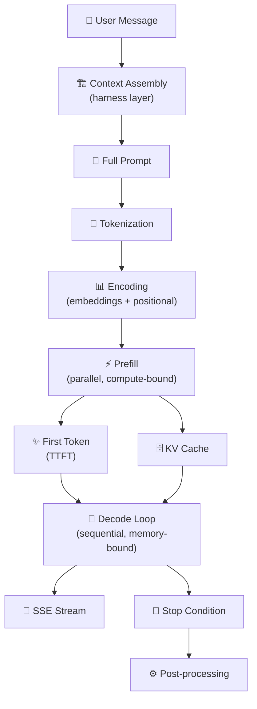

# 3.7 The Token Generation Lifecycle

We've traveled through each stage of the inference pipeline — tokenization, encoding, prefill, decode, streaming, sampling. Now it's worth stepping back and looking at the full picture: how all of these pieces connect from the moment a user sends a message to the moment the last character of the response appears on screen.

Understanding the complete lifecycle is what allows you to reason about latency, diagnose failures, make architecture decisions, and communicate clearly about what's happening inside your AI system. It's also the foundation for every optimization you'll ever make.

---

## The Complete Journey of a Request

Every inference request follows the same fundamental path, regardless of the model, the provider, or the application.

A user types something and presses send. Their request travels through whatever application frontend exists — a web app, a mobile client, an API call from code — and arrives at the inference infrastructure. Before the model sees it, several things happen at the application layer: the user's message gets assembled into a full prompt, combining system instructions, conversation history, retrieved context, and any other components that the context engineering layer has decided to include.

This assembled prompt — now a single string of text — gets submitted to the model.

**Step 1: Tokenization.** The tokenizer processes the prompt and converts it to a sequence of integer IDs. This is fast — typically microseconds — but it sets the stage for everything that follows. The number of tokens determines how much context the model will process and how long the prefill will take.

**Step 2: Encoding.** The token IDs are converted to dense embedding vectors, positional encodings are added, and the attention mask is constructed. The prompt is now represented as a tensor — a matrix of floating-point numbers — ready to enter the transformer stack.

**Step 3: Prefill.** The entire prompt tensor flows through all transformer layers in parallel. Self-attention allows every token to gather information from every other token (subject to the causal mask). The KV cache is populated with the key and value representations of all input tokens. At the end of this phase, the model produces its first output — a vector of logits for what the next token should be.

**Step 4: First token sampling.** The logits from the final prefill layer are passed through the sampling strategy — temperature scaling, nucleus filtering, whatever parameters are configured. A token is selected. This is the first token of the response. It's emitted immediately via the streaming channel.

**Step 5: Decode loop.** The first sampled token is embedded and fed back through the transformer, where it attends to all previous tokens via the KV cache. This produces the next set of logits. Another token is sampled. That token is emitted. The loop repeats, one token per iteration, until a stopping condition is reached.

**Step 6: Stopping.** The loop ends when the model generates an end-of-sequence token, when the output reaches the configured maximum length, or when a stop sequence is encountered. The streaming connection closes, or the buffered response is returned in full.

**Step 7: Post-processing.** The application layer receives the complete or streamed output and does whatever it needs to with it — rendering, parsing, storing, routing to the next step of a workflow.

---

## Where Time Is Actually Spent

Latency is not evenly distributed across these steps. Understanding where time concentrates — and why — is the foundation of inference optimization.

**Tokenization and encoding** are negligible. These happen on CPU, take microseconds, and are never the bottleneck in any real production scenario.

**Prefill** is where **Time to First Token** is determined. For short prompts, prefill might take 50–200ms. For very long prompts filling a large context window, prefill can take several seconds. The bottleneck is GPU compute — specifically, the matrix multiplications required to run the entire prompt through all transformer layers. Optimizations here include prompt caching (reusing KV cache from identical prompt prefixes), flash attention (a memory-efficient attention algorithm that significantly reduces memory bandwidth requirements during prefill), and hardware with higher FLOP throughput.

**The decode loop** is where most of the wall-clock time for longer responses is spent. At 30 tokens per second, generating a 600-token response takes 20 seconds. The bottleneck here is memory bandwidth, not compute — the GPU spends most of its time fetching model weights from memory, not performing arithmetic. Optimizations include increasing batch size (amortizing weight loading across more concurrent requests), model quantization (reducing weight sizes so they load faster), and speculative decoding (using a small draft model to generate candidate tokens that the main model verifies in parallel, increasing effective throughput).

---

## The Cost Structure

The token generation lifecycle also determines the cost structure of AI inference.

Most providers charge per token — both input and output. Input tokens incur their cost during prefill; output tokens during decode. The relative cost per token varies: some providers charge differently for input versus output, reflecting the different computational profiles.

For applications where context is large — long conversation histories, extensive retrieved documents, detailed system prompts — input token costs dominate. For applications where responses are long — detailed analysis, long-form content generation, verbose code — output token costs dominate. Prompt caching can dramatically reduce effective input token costs when the same large context is reused across many requests.

Understanding this cost structure changes how you design applications. A system that fetches and includes ten retrieved documents per query might be retrieving much more context than necessary. A system that generates verbose responses might benefit from instructions that guide the model toward conciseness. These aren't just latency optimizations — they're cost optimizations too.

---

## Failure Modes Across the Lifecycle

Each stage has its own characteristic failure modes, and knowing them helps you triage issues faster.

**Tokenization failures** are rare but real. Unterminated special tokens, malformed input in non-standard encodings, or inputs that tokenize to more tokens than the model's context window can cause failures before inference even begins. These usually surface as error responses before TTFT.

**Prefill OOM** (out-of-memory) happens when the KV cache for the input prompt requires more GPU memory than is available. This is more common with very long context windows and large models. It surfaces as an error immediately after the request is accepted.

**Decode hangs or slow streaming** typically indicate memory bandwidth saturation (the server is processing too many concurrent long-context requests), infrastructure buffering in the streaming path, or connectivity issues on the client side.

**Truncated outputs** occur when the model hits the maximum token limit mid-response. The response stops abruptly, often in the middle of a sentence. Applications should either set max_tokens high enough to accommodate realistic response lengths, or implement detection and graceful handling of truncated outputs.

---

## Seeing the Pipeline as a System

The most valuable thing about understanding the full token generation lifecycle is that it gives you a systems-level view of what's happening inside your AI application. You stop seeing the model as a black box and start seeing it as a pipeline with distinct phases, different computational profiles, specific bottlenecks, and clear failure modes.

This mental model is what makes it possible to make good engineering decisions — when to optimize for TTFT versus throughput, when prompt caching is worth the complexity, when to prefer a smaller model, when streaming infrastructure needs attention. Every AI engineering decision benefits from this foundation.

The lifecycle also connects back to everything in the context engineering chapter: the better the context assembly, the more focused the prefill computation, the more relevant the decode loop's output. Context engineering and inference engineering aren't separate concerns — they're two sides of the same request.
